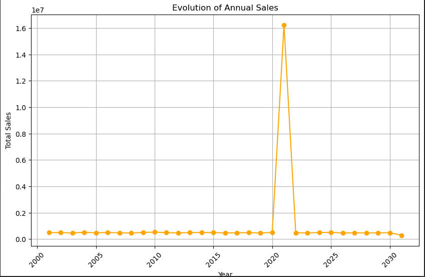

# Sales Data Analysis for the Year 2019

#### Sales data was collected for each month in the entire year of 2019. 

## Project Description
 Our client has collected transactional data for the year 2019 but hasn't been able to utilize it effectively.
 Sales data was collected for each month in the entire year of 2019. The data for the first half of the year (January to June) was collected in Excel and saved as CSV files before management decided to use databases to store their data.

This initiative aims to leverage the existing data to provide valuable insights and strategic recommendations to our client, enabling them to optimize their business performance and make informed decisions for the future.

## Visualize Preview

Below is a preview showcasing some features :

    

        
Sale Comparison

             
    

    

        
View Sale Month

             
        

    

        
Frequency Result

        
        

   

        
Frequency Result

        
        

## Resources
Here are some ressources you would read to have a good understanding of Serie Temporelle :
- [Tutorial - User Guide](https://www.youtube.com/watch?v=CrF02LNy2pM)
- [Tutorial - User Guide](https://www.youtube.com/watch?v=PmAOZRnfqBU)
  

## Author
[Bambo Traore](https://www.linkedin.com/in/traore-bamba/)
